# GUARDIAN Architecture Visual for Investors

## The Privacy-First Advantage

## How GUARDIAN Eliminates Risk

## Market Opportunity Visualization

## Competitive Positioning

```mermaid
graph TB
    Title[Market Positioning]
    
    subgraph "High Privacy"
        HP[GUARDIAN]
    end
    
    subgraph "Medium Privacy"
        MP1[On-Premise ELN]
        MP2[Private Cloud Solutions]
    end
    
    subgraph "Low Privacy"
        LP1[Traditional Cloud ELN]
        LP2[Generic AI Tools]
        LP3[Standard Compliance Software]
    end
    
    subgraph "Compliance Capability"
        CC1[Manual → Automated]
    end
    
    HP --> |100% Automated + Zero Trust| CC1
    MP1 --> |50% Automated| CC1
    LP1 --> |30% Automated| CC1
    
    style HP fill:#00cc00,stroke:#009900,color:#fff
    style MP1 fill:#ffcc00,stroke:#ff9900,color:#000
    style LP1 fill:#ff6600,stroke:#cc3300,color:#fff
```

## ROI Calculator

## Growth Trajectory

```mermaid
graph LR
    Title[5-Year Revenue Projection]
    
    Y1[Year 1: €2.4M]
    Y2[Year 2: €12M]
    Y3[Year 3: €24M]
    Y4[Year 4: €60M]
    Y5[Year 5: €120M]
    
    Y1 -->|5x| Y2
    Y2 -->|2x| Y3
    Y3 -->|2.5x| Y4
    Y4 -->|2x| Y5
    
    style Y5 fill:#00cc00,stroke:#009900,color:#fff,stroke-width:4px
```

## The GUARDIAN Difference

| Risk Factor | Industry Average | GUARDIAN |
|-------------|------------------|----------|
| 🚨 **Data Breach Risk** | $10.93M | $0 |
| 🤖 **AI Hallucination** | High | Zero (your docs only) |
| 🔒 **Vendor Lock-In** | High | None |
| ⏱️ **Setup Time** | 3-6 months | Minutes |
| 📊 **Compliance Automation** | 30% | 100% |
| 🌍 **Data Sovereignty** | None | Complete |

## Why Investors Love GUARDIAN

1. **Massive Market**: $5.2B TAM with 10%+ CAGR
2. **Zero Competition**: First zero-trust pharmaceutical compliance platform
3. **Sticky Revenue**: 95%+ retention (switching means losing privacy)
4. **Network Effects**: Each customer strengthens compliance database
5. **Exit Opportunities**: Strategic acquisition target for $100B+ companies

*"GUARDIAN isn't just a product - it's a new category of privacy-first enterprise software that makes data breaches mathematically impossible."*