# GUARDIAN Data Flow Architecture - Fixed Diagrams

## Privacy-First Architecture Overview

GUARDIAN implements a **privacy-first architecture** where user data never touches our servers permanently. All sensitive user data resides in the user's personal Google Drive, while our PostgreSQL database only stores session metadata and authentication tokens.

## Privacy-First Data Flow Architecture

### High-Level System Architecture

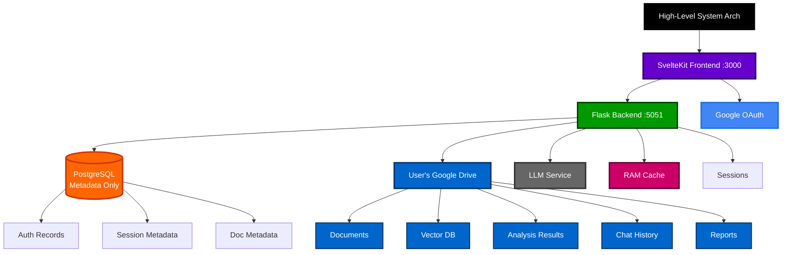

## Data Flow Components

### 1. Frontend (SvelteKit) - Port 3000
**Purpose:** User interface and client-side state management
**Data Stored:** 
- Session tokens (localStorage)
- UI state (Svelte stores)
- No sensitive user data

### 2. Backend (Flask) - Port 5051
**Purpose:** API orchestration and session management
**Data Stored:**
- **TEMPORARY ONLY**: Active vector databases in RAM during user sessions
- **NO PERMANENT STORAGE** of user documents or analysis results

### 3. PostgreSQL Database
**Purpose:** Metadata and session coordination only
**Data Stored:**
```sql
-- User authentication metadata
users: {
  id, google_id, email, encrypted_drive_tokens, created_at
}

-- Session tracking metadata  
sessions: {
  id, user_id, session_token_hash, expires_at, created_at
}

-- Vector database session metadata
vector_sessions: {
  id, user_id, session_id, status, drive_file_id, created_at
}

-- Document metadata (NO CONTENT)
documents: {
  id, user_id, filename, file_size, drive_file_id, processed_at
}

-- Chat session metadata (NO MESSAGES)
chat_sessions: {
  id, user_id, session_id, drive_backup_id, created_at
}
```

### 4. User's Google Drive
**Purpose:** Private data storage and persistence
**Data Stored:**
```
/GUARDIAN_Data/
├── Documents/              # User uploaded files
├── Vector_Database/        # FAISS indexes and embeddings
├── Analysis_Results/       # Compliance analysis outputs
├── Chat_History/          # LLM conversation history
├── Reports/               # Generated PDF/HTML reports
└── Session_Data/          # Session backups and metadata
```

### 5. Temporary Processing (RAM)
**Purpose:** Active session processing
**Data Stored:**
- Vector databases loaded from user's Drive
- Document chunks and embeddings during processing
- **Automatically cleaned up when session expires**

## Detailed Data Flows

### Authentication Flow

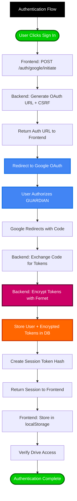

### Document Upload & Processing Flow

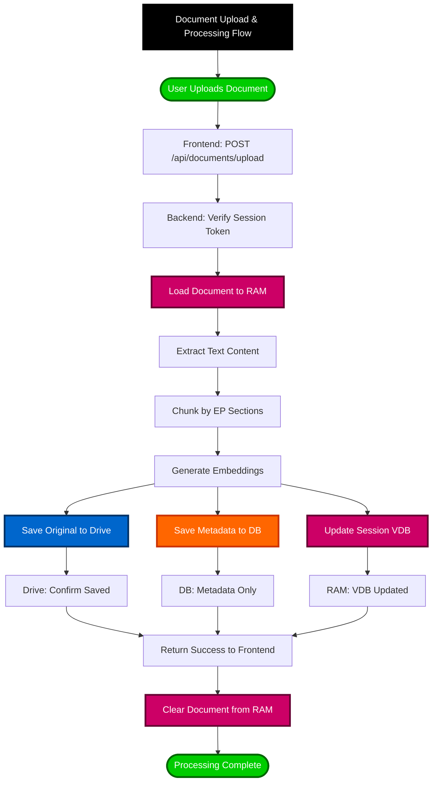

### Protocol Compliance Analysis Flow

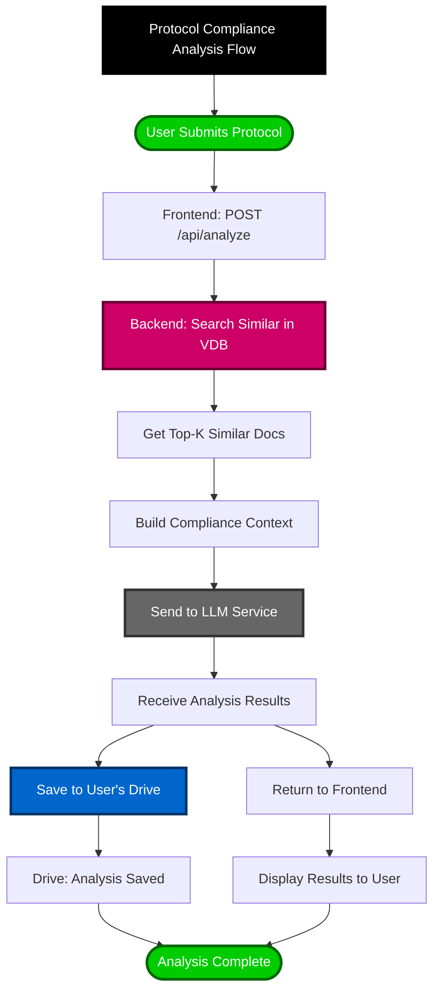

### AI Chat Flow

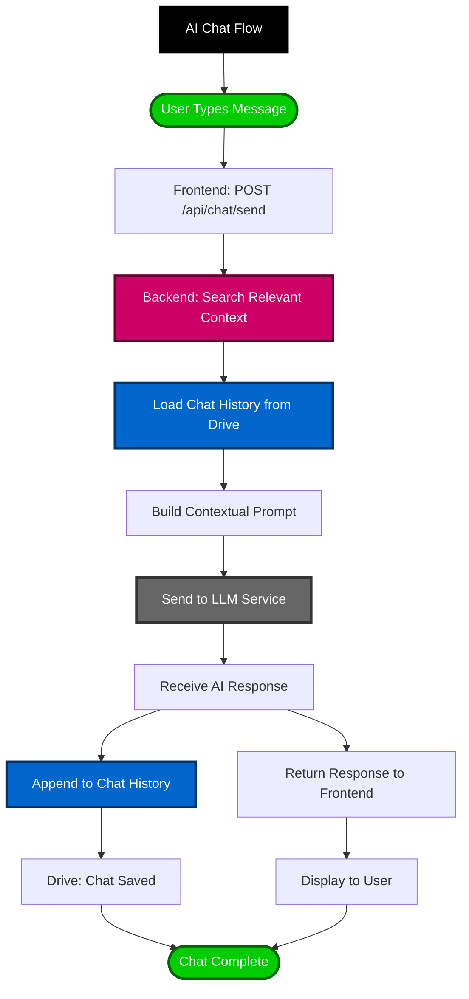

### Session Cleanup & Privacy Protection Flow

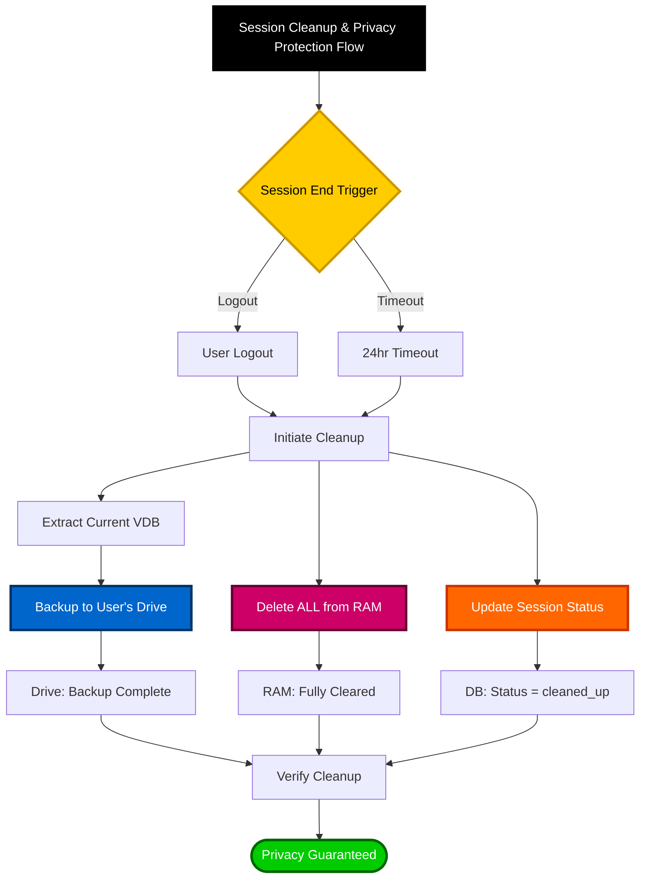

## Privacy Guarantees

### What NEVER Leaves User's Google Drive
- **Document content** (PDFs, text files, etc.)
- **Analysis results** (compliance findings, reports)
- **Chat conversations** (LLM conversations and history)
- **Vector databases** (embeddings and search indexes)
- **Generated reports** (PDF/HTML outputs)

### What's Stored in Our PostgreSQL (Metadata Only)
- **User profile** (Google ID, email, encrypted Drive tokens)
- **Session tracking** (session IDs, expiration times)
- **Document metadata** (filenames, file sizes, Drive file IDs)
- **System logs** (errors, performance metrics)

### What's Temporarily in Backend Memory
- **Active vector databases** (loaded during user session)
- **Processing buffers** (document chunks during upload)
- **Search results** (similarity search outputs)
- **Automatically cleaned up** when session ends

## Security & Compliance

### Data Encryption
- **In Transit**: All API calls use HTTPS/TLS
- **At Rest (Drive)**: Google Drive's encryption
- **At Rest (Database)**: Encrypted OAuth tokens using Fernet
- **In Memory**: Temporary processing only

### Access Control
- **OAuth 2.0**: Industry standard authentication
- **Session-based**: Temporary session tokens
- **User isolation**: Complete separation between users
- **Drive permissions**: Users control their own data

### Compliance Features
- **GDPR Ready**: User data in their own Drive
- **Right to deletion**: User deletes their own Drive folder
- **Data portability**: User owns all data in standard formats
- **Audit trails**: PostgreSQL logs access patterns only

## Deployment Architecture

### Production Deployment Architecture

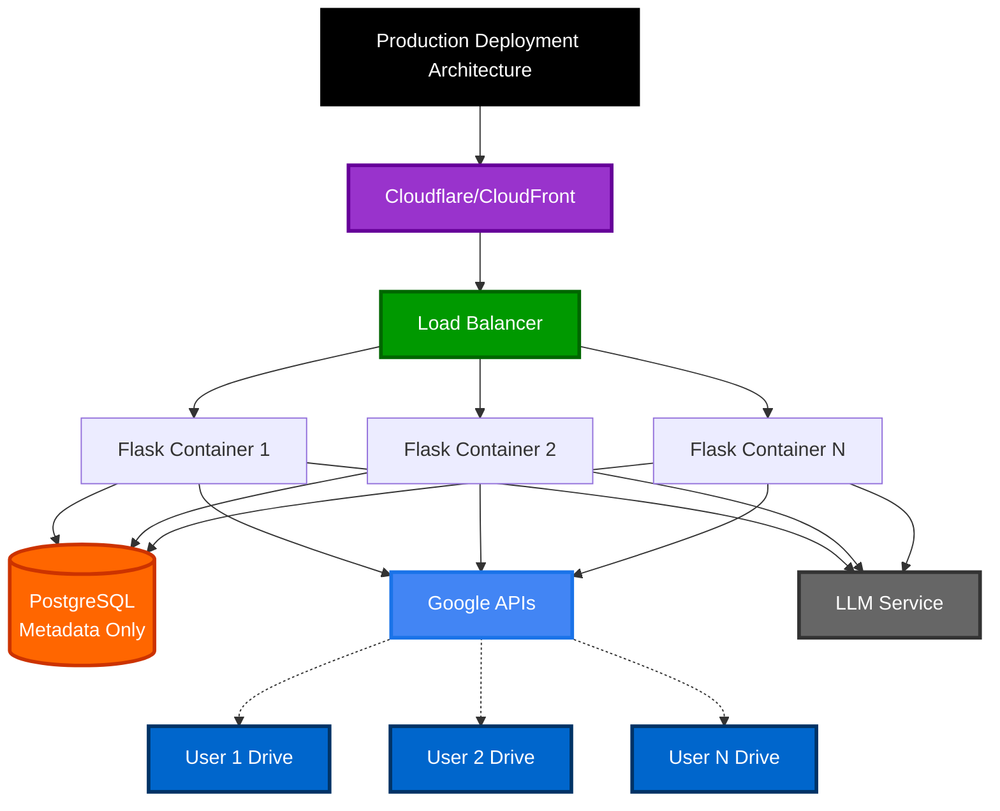

### Local Development Architecture

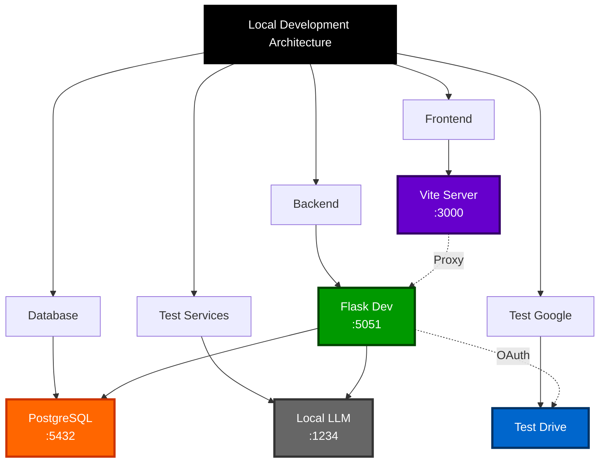

## Performance Characteristics

### Response Times
- **Authentication**: ~500ms (OAuth exchange)
- **Document upload**: ~2-5s (depending on file size)
- **Analysis**: ~3-8s (LLM processing time)
- **Search**: ~100-300ms (FAISS vector search)
- **Chat**: ~2-4s (LLM response time)

### Scalability
- **Users**: Unlimited (data in their own Drives)
- **Documents per user**: Limited by their Google Drive quota
- **Concurrent sessions**: Limited by backend memory/CPU
- **Database size**: Minimal (metadata only)

### Storage Efficiency
- **Backend storage**: Near zero (temporary processing only)
- **Database size**: ~1KB per user (metadata only)
- **User data**: Stored in their 15GB+ Google Drive quota
- **Vector databases**: Compressed and stored in user's Drive

## Privacy-First Architecture Flow

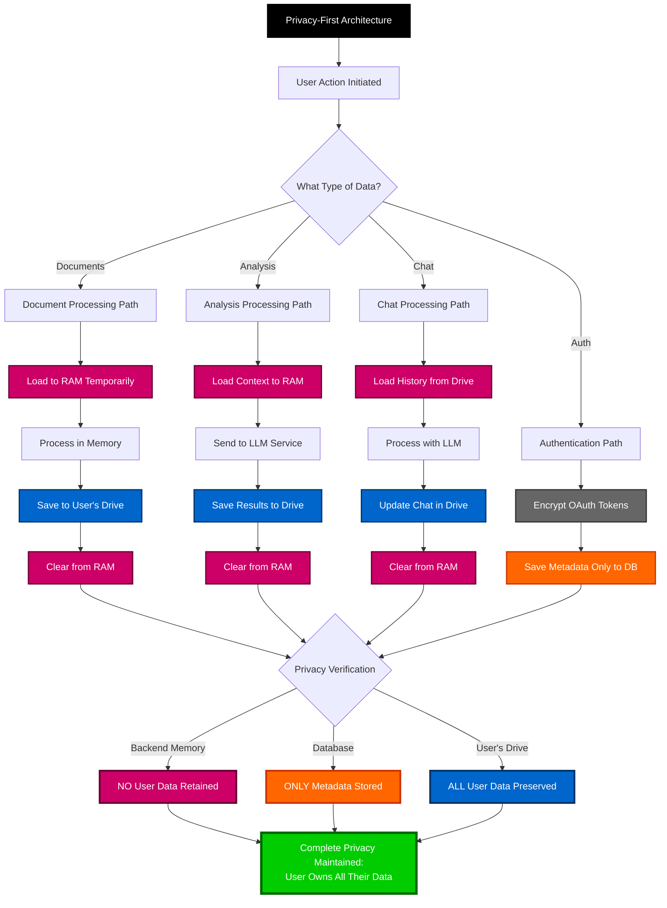

### Ground Truth vs Protocol Query Flow (Two-Tier Document System)

```mermaid
graph TB
    Title[Ground Truth vs Protocol Query Flow]
    Title --> Start([User Workflow Start])
    
    Start --> Phase1[Phase 1: Upload Ground Truth Documents]
    Phase1 --> GTUpload[Upload European Pharmacopoeia Standards]
    GTUpload --> GTClassify[Backend: Classify as document_type='ground_truth']
    GTClassify --> GTFolder[Store in Drive: /Ground_Truth_Standards/]
    GTFolder --> GTEmbedding[Generate Embeddings with Type Metadata]
    GTEmbedding --> GTVectorDB[Add to User VectorDB with Type Filters]
    
    GTVectorDB --> Phase2[Phase 2: Upload Protocol Documents]
    Phase2 --> ProtUpload[Upload User Protocols to Analyze]
    ProtUpload --> ProtClassify[Backend: Classify as document_type='protocol']
    ProtClassify --> ProtFolder[Store in Drive: /User_Protocols/]
    ProtFolder --> ProtEmbedding[Generate Embeddings with Type Metadata]
    ProtEmbedding --> ProtVectorDB[Add to User VectorDB with Type Filters]
    
    ProtVectorDB --> Phase3[Phase 3: Protocol Analysis Against Ground Truth]
    Phase3 --> QueryInit[User: Analyze Protocol Against Standards]
    QueryInit --> TypeFilter[Backend: Apply Document Type Filtering]
    
    TypeFilter --> GTOnlySearch[Search ONLY Ground Truth Documents]
    GTOnlySearch --> EuroPharm[Filter: European Pharmacopoeia Categories]
    EuroPharm --> USPStandards[Filter: USP Standards]
    USPStandards --> ICHGuidelines[Filter: ICH Guidelines]
    ICHGuidelines --> TopKResults[Get Top-K Relevant Standards]
    
    TopKResults --> ContextBuild[Build Compliance Context]
    ContextBuild --> LLMAnalysis[LLM: Analyze Protocol vs Standards]
    LLMAnalysis --> ComplianceReport[Generate Compliance Assessment]
    
    ComplianceReport --> SaveResults[Save Analysis Results to Drive]
    ComplianceReport --> UserResults[Return Detailed Analysis to User]
    
    SaveResults --> ResultsFolder[Drive: /Analysis_Results/]
    UserResults --> DisplayUI[Frontend: Display Compliance Findings]
    
    ResultsFolder --> Complete([Analysis Complete])
    DisplayUI --> Complete
    
    %% Styling for different document types
    style Title fill:#000000,stroke:#000000,stroke-width:3px,color:#fff
    style Start fill:#00cc00,stroke:#006600,stroke-width:3px,color:#fff
    style Complete fill:#00cc00,stroke:#006600,stroke-width:3px,color:#fff
    
    %% Ground Truth styling (Blue)
    style Phase1 fill:#0066cc,stroke:#003366,stroke-width:3px,color:#fff
    style GTUpload fill:#0066cc,stroke:#003366,stroke-width:2px,color:#fff
    style GTClassify fill:#0066cc,stroke:#003366,stroke-width:2px,color:#fff
    style GTFolder fill:#0066cc,stroke:#003366,stroke-width:2px,color:#fff
    style GTEmbedding fill:#0066cc,stroke:#003366,stroke-width:2px,color:#fff
    style GTVectorDB fill:#0066cc,stroke:#003366,stroke-width:2px,color:#fff
    
    %% Protocol styling (Orange)
    style Phase2 fill:#ff6600,stroke:#cc3300,stroke-width:3px,color:#fff
    style ProtUpload fill:#ff6600,stroke:#cc3300,stroke-width:2px,color:#fff
    style ProtClassify fill:#ff6600,stroke:#cc3300,stroke-width:2px,color:#fff
    style ProtFolder fill:#ff6600,stroke:#cc3300,stroke-width:2px,color:#fff
    style ProtEmbedding fill:#ff6600,stroke:#cc3300,stroke-width:2px,color:#fff
    style ProtVectorDB fill:#ff6600,stroke:#cc3300,stroke-width:2px,color:#fff
    
    %% Analysis styling (Purple)
    style Phase3 fill:#6600cc,stroke:#330066,stroke-width:3px,color:#fff
    style QueryInit fill:#6600cc,stroke:#330066,stroke-width:2px,color:#fff
    style TypeFilter fill:#6600cc,stroke:#330066,stroke-width:2px,color:#fff
    style GTOnlySearch fill:#6600cc,stroke:#330066,stroke-width:2px,color:#fff
    style ContextBuild fill:#6600cc,stroke:#330066,stroke-width:2px,color:#fff
    style LLMAnalysis fill:#666666,stroke:#333333,stroke-width:2px,color:#fff
    style ComplianceReport fill:#6600cc,stroke:#330066,stroke-width:2px,color:#fff
    
    %% Results styling (Green)
    style SaveResults fill:#009900,stroke:#006600,stroke-width:2px,color:#fff
    style UserResults fill:#009900,stroke:#006600,stroke-width:2px,color:#fff
    style ResultsFolder fill:#009900,stroke:#006600,stroke-width:2px,color:#fff
    style DisplayUI fill:#009900,stroke:#006600,stroke-width:2px,color:#fff
```

### Document Type Classification Flow

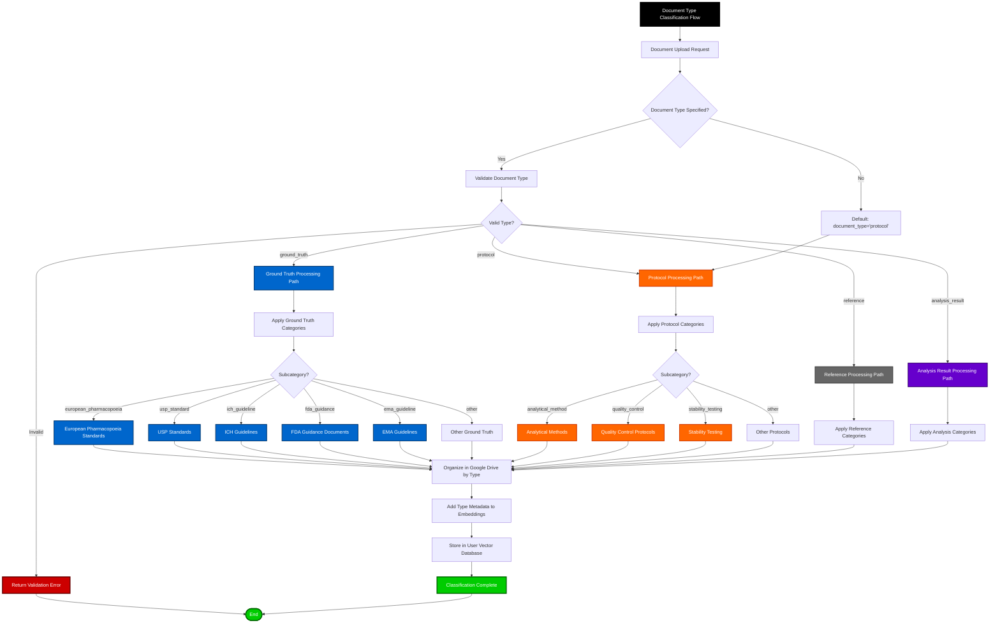

### Vector Search with Document Type Filtering

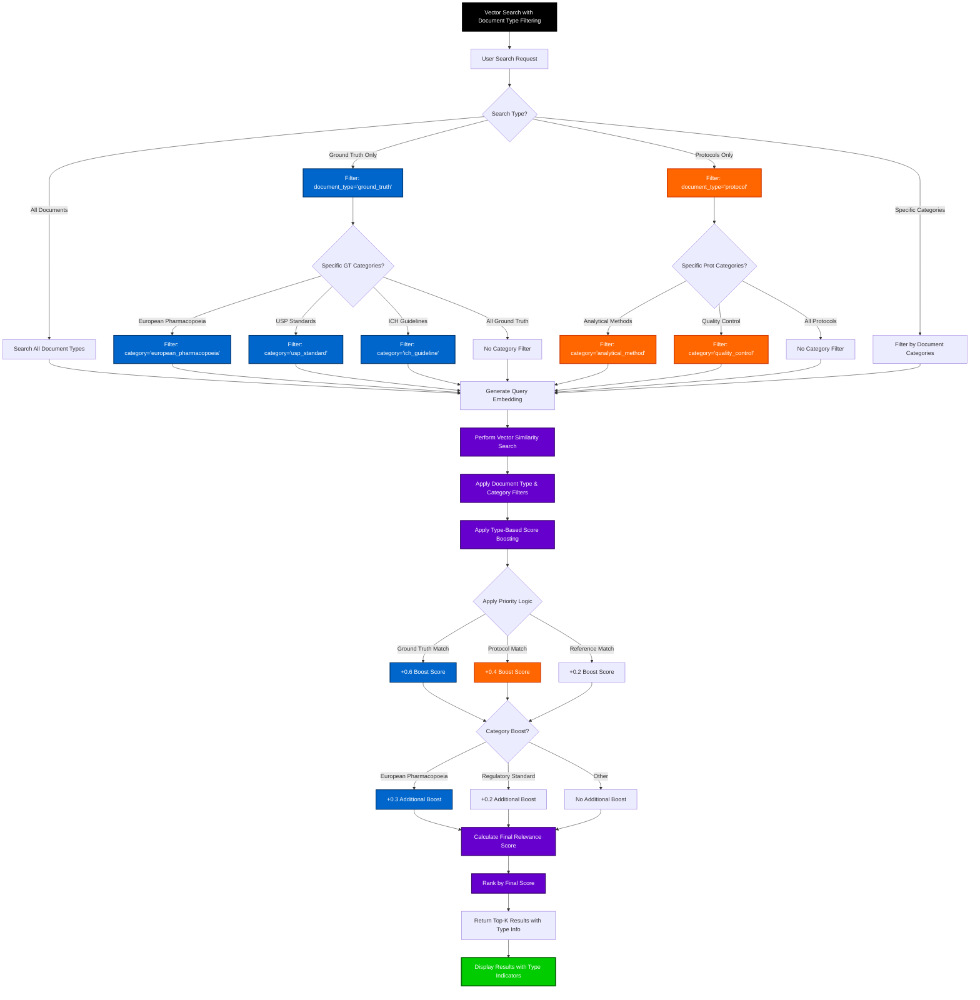

## Document Type Architecture Summary

The ground truth vs protocol query system implements a **two-tier document classification** that enables targeted pharmaceutical compliance analysis:

### Document Type Hierarchy
1. **Ground Truth Documents** (`document_type='ground_truth'`)
   - European Pharmacopoeia standards
   - USP monographs and standards
   - ICH guidelines
   - FDA guidance documents
   - EMA guidelines

2. **Protocol Documents** (`document_type='protocol'`)
   - User-uploaded analytical methods
   - Quality control procedures
   - Stability testing protocols
   - Manufacturing procedures

3. **Reference Documents** (`document_type='reference'`)
   - Supporting documentation
   - Additional reference materials

4. **Analysis Results** (`document_type='analysis_result'`)
   - Generated compliance reports
   - AI analysis outputs

### Query Flow Benefits
- **Targeted Analysis**: Protocols analyzed specifically against regulatory standards
- **Relevance Scoring**: Ground truth documents receive priority in similarity matching
- **Type-Aware Search**: Filter searches by document type and category
- **Compliance Context**: LLM receives proper regulatory context for analysis
- **Organized Storage**: Type-based folder structure in user's Google Drive

### Privacy Preservation
- **Complete User Isolation**: Each user's documents remain in their personal Google Drive
- **Type-Based Organization**: Documents organized by type in user's Drive folders
- **Metadata-Only Database**: Only document type information stored in PostgreSQL
- **Temporary Processing**: All document content processed in RAM only

This architecture ensures complete user privacy while providing powerful AI-powered pharmaceutical compliance analysis capabilities.